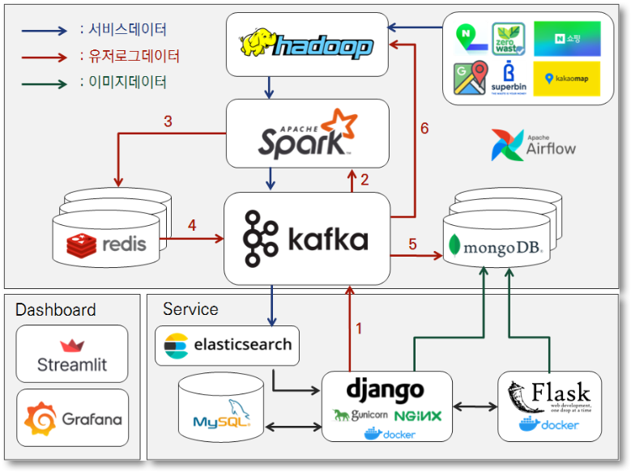
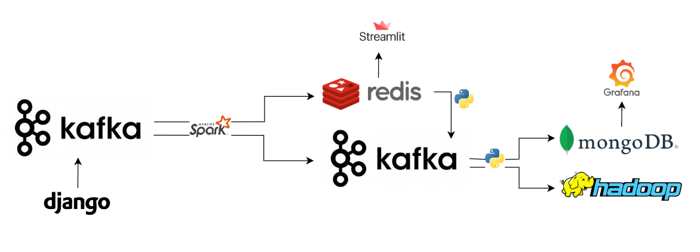
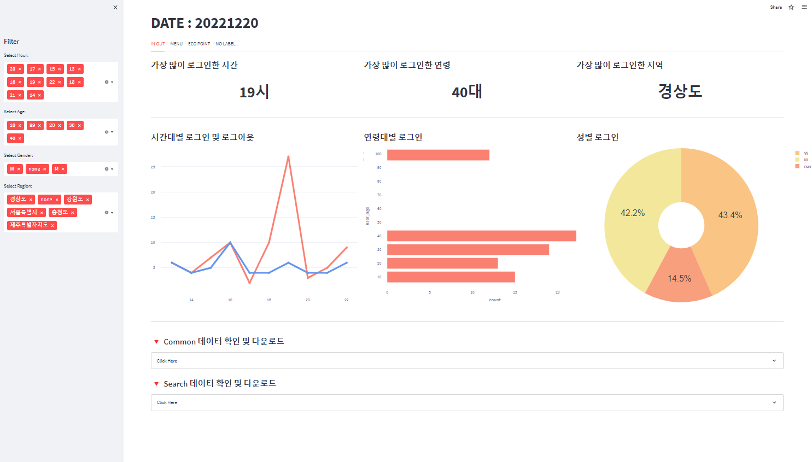
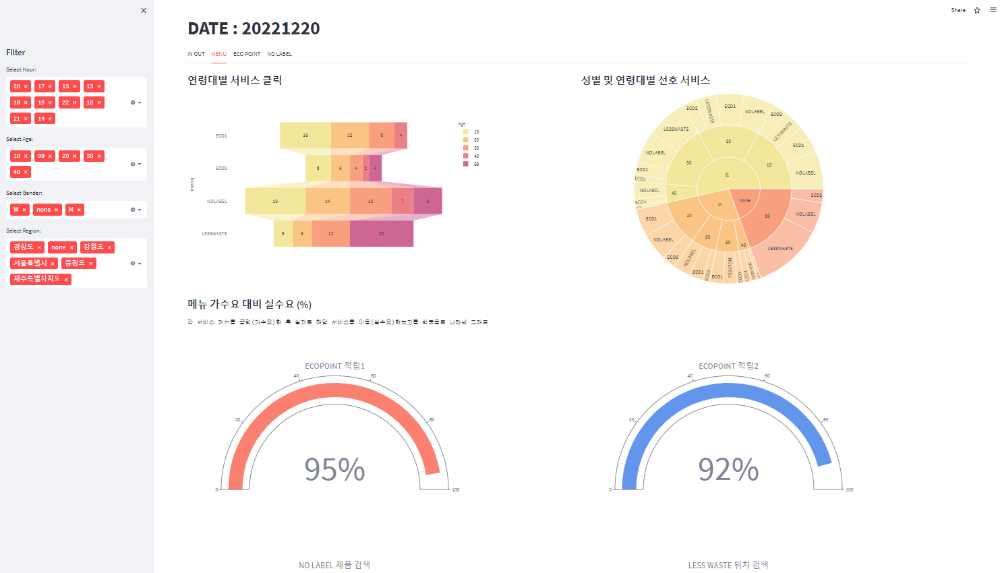
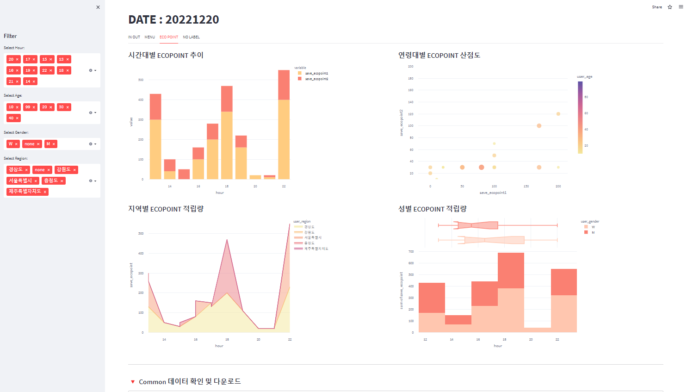
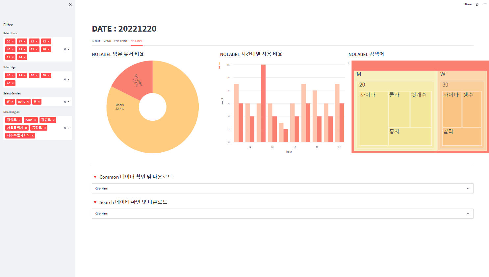
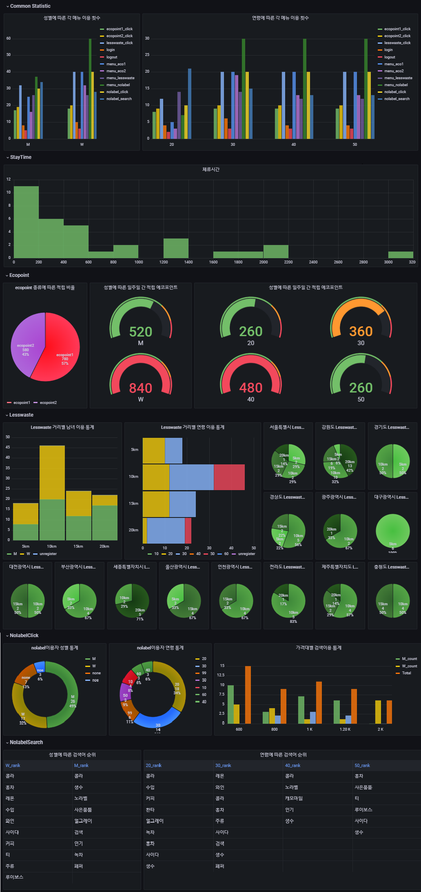
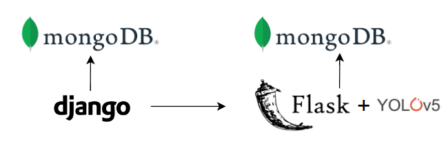
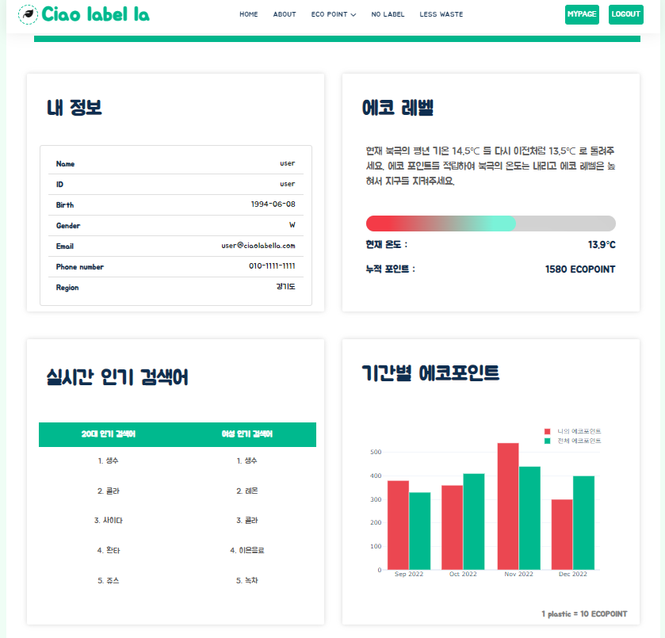

# PJT_Ciaolabella2

[Ciao laBella - Extension] 라벨 여부 이미지 인식에 따른 에코포인트 적립 서비스 - 확장 데이터 파이프라인 구축

---

## 1. 프로젝트 개요

- 1차 프로젝트 기간 : 2022.08.18 ~ 2022.09.30
  - Ciaolabella ver.1 포트폴리오
- 2차 프로젝트 기간 :  2022.10.12 ~ 2022.12.21
  - Ciaolabella ver.2 서비스 
  - [Ciao label la ver.2 기술 공유 노션](https://www.notion.so/Ciaolabella-4b32bd0e550a4414922b89975965cc7d)
  - Team Ozi : [고유정](https://github.com/yu-je0ng), [김세진](https://github.com/nijes), [류재선](https://github.com/prudent-PS), [이경덕](https://github.com/Kyung-Deok), [주한나](https://github.com/hanna-joo)

- 기존 ciaolabella 서비스를 확장하여 

  1) 유저 로그를 수집·집계·적재·시각화하는 파이프라인을 구축 

  2. 주기적인 서비스 업데이트를 위한 스케쥴링 

  3. 모델 재학습을 위한 유저 업로드 사진 및 모델 결과 수집

  4. 실시간 검색어 제공, 유저 맞춤형 마이페이지 등 서비스 고도화

## 2. 프로젝트 설계

### 2.1. 아키텍쳐 정의서 

### 2.2. 클러스터 노드 정의서 

  | Category          | Name          | Version    |
  | ----------------- | ------------- | ---------- |
  | Environment       | AWS EC2       | free tier  |
  |                   | Ubuntu        | 20.04      |
  | Big Data Platform | Kafka         | 2.12-3.2.0 |
  |                   | Zookeeper     | 3.8.0      |
  |                   | Hadoop        | 3.3.3      |
  |                   | Spark         | 3.1.3      |
  |                   | Elasticsearch | 7.17.5     |
  |                   | Airflow       | 2.5.0      |
  | Database          | MySQL         | 8.0.31     |
  |                   | MongoDB       | 4.4.5      |
  |                   | Redis         | 7.0.5      |
  | Web Development   | Flask         | 2.2.2      |
  |                   | Django        | 3.2.16     |
  |                   | Nginx         |            |
  |                   | Docker        |            |

## 3. 파이프라인 확장 및 보안

### 3.1. 사용자 로그 데이터 

**(1) 유저 로그 데이터 플로우**

- 유저 로그 데이터 활용도에 따른 구분 및 저장
  - `Hot data` : 당일 발생한 로그 데이터 (실시간 시각화 및 분석 용도)
  - `Warm data` : 최근 일주일 치 로그 데이터 (체류시간 포함 일주일 치 시각화 및 분석 용도)
  - `Cold data` : 과거 모든 로그 데이터 (향후 분석 및 백업 용도)
- Hot Data
  - 원본 로그
    - Django 에서 수집한 원본 로그 데이터를 1차적으로 데이터허브인 Kafka 에 저장
  - 실시간 로그 집계
    - Spark-streaming을 통하여 실시간 데이터에 대해 1분 또는 5분 단위로 집계하여 Redis 에 저장
    - Redis-Streamlit 을 통한 시각화 대시보드
  - 배치 로그 집계
    - Spark 을 통하여 당일 발생 로그에 대해 집계본을 만들어 Kafka 에 저장
- Warm Data
  - Redis 에 저장된 전날 발생한 실시간 로그 집계 데이터를 2차적으로 Kafka에 저장
  - 최근 일주일치 발생한 로그 집계 데이터를 Kafka 에서 MongoDB에 저장
  - MongoDB-Grafana를 통한 시각화 대시보드
- Cold data
  - 전체 데이터를 Hadoop에 csv 형식으로 저장
- **Airflow 를 통하여 데이터 플로우 자동화**

**(2) Redis 로그 시각화 대시보드**

**(3) MongoDB 로그 데이터 시각화 대시보드**

### 3.2. 사용자 업로드 이미지 데이터 수집 

- Django 서비스에서 유저가 업로드한 이미지 원본을 grifs를 이용하여 mongodb에 저장
- Flask app에서 원본 이미지에 대한 yolov5모델 결과가 포함된 이미지를 grifs를 이용하여 mongodb에 저장

## 4. 서비스 고도화

### 4.1 무라벨 제품 조회 서비스 자동 업데이트

- 파이썬 스크립트를 통하여 웹에서 nolabel 제품데이터 크롤링 후 원본 hadoop에 적재
- spark를 통한 원본 데이터 가공 후 Kafka 적재 후 es 저장
- 매주 일요일 02:00 데이터 업데이트 되도록 Airflow를 통한 스케쥴링

### 4.2 사용자 맞춤형 실시간 검색어 제공

**(1) 구현 방안**

- `1단계` : 무라벨 제품 검색 서비스에서 발생하는 검색어 로그 수집
- `2단계` : Spark-streaming 을 통하여 실시간 집계 후 인메모리 저장소인 Redis 에 저장
- `3단계` : 마이페이지에서 해당 회원의 성별과 연령대에 해당하는 검색어 조회 및 표시

**(2) 구현 결과**

